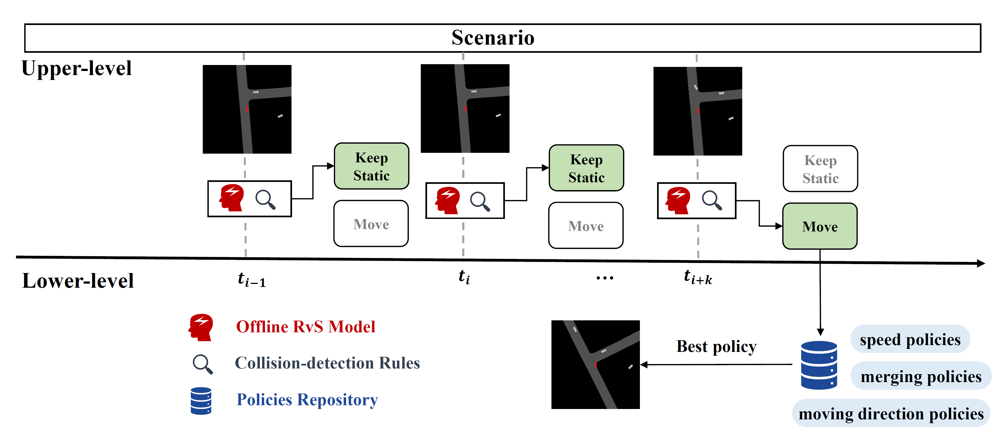
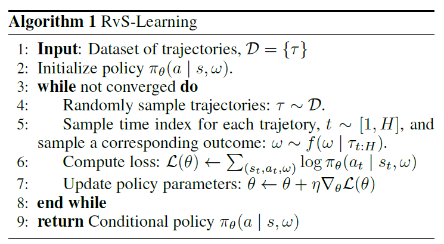

## Source code
This agent was contributed as part of NeurIPS2022 Driving SMARTS competition. The source code by original authors is available at https://github.com/superCat-star/fanta-code.

## 1. Overall Framework

In this competition, we design a hierarchical framework to solve the SMARTS autonomous driving tasks.  The overall framework consists of two modules, the upper-level module and the lower-level module. The upper-level module is in charge of deciding whether the ego should move or keep static. This module consists of an offline learning agent trained via RvS (Reinforcement learning Via Supervised learning) [1] and a rule-based collision-detection module.  The lower-level module consists of three policies to make decisions about the ego's speed, heading and whether to change to a different lane.

## 2. Upper-level Module

The upper-level module is in charge of deciding whether the ego should move or keep static.  We first design a rule-based collision-detection module to check whether there will appear vehicles that threaten the safe driving of ego in the near future. In each step, this rule will detect whether there is a vehicle in the near area in the current and near future (usually 0.5s).  This area is an $N * M$ rectangular. In the driving direction of the ego, the length of this rectangular is $N$ meters (5m in cruising,  7m in turning, 0m near the goal position in lane changing, 2.5m in merging); in the normal direction of the driving direction of the ego, the length is $M$ meters (usually 1.25m).  If there is such a vehicle, it is considered that there is a risk of collision, and this rule will require the vehicle to keep static.

However, as the actual driving scenarios are so complicated, this simple collision-checking module is not able to detect all the potential risks. Therefore,  we train an offline agent via RvS using the officially provided Waymo motion datasets. The RvS model and collision-detection rule vote on whether the ego should be static or moving in the next step, and both of them have a one-vote veto to keep the ego static for security consideration.

In this part, we'll introduce the RvS method we adopt, the design of Markov Decision Process (MDP), the preprocessing of Waymo datasets.

## 2.1 RvS Algorithm

To formulate RvS methods in a general way, we first assume an agent interacts with a Markov decision process with states $s_t$, actions $a_t$, initial state distribution $p_s\left(s_1\right)$, and dynamics $p\left(s_{t+1} \mid s_t, a_t\right)$. The agent chooses actions using a policy $\pi_\theta\left(a_t \mid s_t\right)$ parameterized by $\theta$. We assume episodes have fixed length $H$ and use $\tau=\left(s_1, a_1, r_1, s_2, a_2, r_2, \cdots\right)$ to denote a trajectory of experience. As some trajectories might be described using multiple outcomes, we use $f(\omega \mid \tau)$ to denote the distribution over outcomes that occur in a trajectory.  We focus on RvS methods applied to the offline RL setting. These methods take as input a dataset of experience, $\mathcal{D}=\{\tau\}$ and find the outcome-conditioned policy $\pi_\theta\left(a_t \mid s_t, \omega\right)$ that optimizes

$$
\max _\theta \sum_{\tau \in \mathcal{D}} \sum_{1 \leq t \leq|\tau|} \mathbb{E}_{\omega \sim f\left(\omega \mid \tau_{t: H}\right)}\left[\log \pi_\theta\left(a_t \mid s_t, \omega\right)\right]
$$
The overall algorithm is described in the following figure:

## 2.2 MDP

Stat: The states include the bounding box of ego, the speed limit of the current lane, the relative heading, position and speed of the five closest vehicles to ego, and the bounding box of these closest vehicles.

Action: There are two discrete actions to control the ego to move and keep static. Since the speed of vehicles in the Waymo data set is continuous, there are few egos that are absolutely static. We use the bucketing strategy to discretize the speed of the egos. The egos whose speed is less than 0.2 times the speed limit are assumed to be in a static state. Otherwise, the car is assumed to be in a moving state.

Goal: We set the $f(\omega \mid \tau)$ to be the waypoints and headings in the subsequent next 5 steps, which is the short-term goal position the ego is about to visit. 

## 2.3 Data Preprocessing

We perform several data preprocessing techniques to get our training sets.

* Correcting abnormal headings: In the SMARTS data set converted from the Waymo dataset, in a small number of scenarios, the heading of the ego will mutate at a certain step and turn back to normal at the next step. In order to deal with this problem, we assume that under normal circumstances, the heading of the ego will not mutate by more than 8 degrees within 1 step (0.1s), and use this as a criterion to find out the abnormal ego heading data in the dataset, and use a linear interpolation function to fix the heading of the abnormal data.

* Filtering data: In order to enable the trained RvS model to cope with turning, lane-changing and cruising scenarios at the same time, we filter the data from the officially recommended subset of the Waymo dataset, and constructed a dataset that includes turning, lane-changing and cruising. Specifically,  from the recommended data subset, we first filter out all the data in which the heading changes by more than 0.5 degrees within two steps from the steps before and after the turning/lane-changing behavior to be the data of turning or lane-changing scenarios. Then, we count the average trajectory length of the turning/lane changing data, and randomly select a part of the data whose trajectory length is equal to the "average trajectory length of the turning/lane changing data" from the remaining data of the recommended data subset, as the cruising data. The ratio of turn/lane change data to cruising data is 2:1.

* Simulate waypoint: As the lane information and waypoint information in the SMARTS format data set converted from the Waymo data set are relatively chaotic, the waypoint information in obs.waypoint_paths cannot be used in complex road conditions such as turns and lane intersections. In order to characterize the future motion trend of the ego well, we approximate the position of the ego in the next 5 steps as the coordinate point of the lane where the ego is located. And it is stipulated that the distance_travelled distance between each two coordinate positions shall not be less than 0.3m (if it is less than, it will be extended backwards)

* Speed discretization: As mentioned in the previous section, we use the bucketing strategy to discretize the speed of the ego. The egos whose speed is less than 0.2 times the speed limit are assumed to be in a static state. Otherwise, the car is assumed to be in a moving state. In rare cases, the index of the lane where the ego is located cannot be indexed in waypoint_paths. In this case, we approximately regard the speed limit of lane 0 in waypoint_paths as the speed limit of the current lane.

* Eliminate useless social vehicles: We remove all social vehicles in the dataset that park on the side of the road that do not affect the decision-making of ego, that is, vehicles whose lane_id is 'off_lane'.

# 3. Lower-level Module

After the upper-level policy makes a decision to move forward, the lower-level module, which is a policies repository, maintains several policies to control the moving of the ego. These policies include speed policies, moving direction policies, and merging policies.

## 3.1 Speed Policies

The speed policy first determines a baseline speed according to the curvature of the lane where the ego is located, and then calculates the speed attenuation coefficient according to the traffic density near the ego, multiplied by the baseline speed to obtain the final speed.  When there are no other vehicles nearby, the ego's baseline speed attenuation coefficient is 1. For every other vehicle, the ego's speed is reduced by 2%.  In the cruising scenario, the baseline speed is the maximum speed limit of the current lane. In the turning scenario, the baseline speed is 0.5 times the speed limit of the current lane. The ego will detect the number of other vehicles within 20m.

## 3.2 Moving Direction Policies

Moving direction policies control the movement of ego along the waypoints of a lane. When the lane-changing policy does not make a lane-changing behavior, the target lane is the lane where the ego is currently located. When receiving an instruction to change lanes in a certain direction, the ego will modify the target lane to the adjacent lane in the corresponding direction. When moving, the moving direction policy will take out a waypoint from the middle of the 2nd to 4th waypoints in the target lane according to the specific state of the ego, and modify the ego's heading to face the waypoint, and command the ego to move according to the speed determined by the speed policy towards that waypoint.

## 3.3 Merging Policies

We will calculate an expected speed for the current lane and the adjacent lanes on both sides according to the speed of other vehicles within a certain range in front of the road, and control the ego to move to the lane with the highest expected speed among the three lanes. Considering the safety risk and loss of moving distance brought by lane changing, we impose a penalty term for the expected speed of 2 adjacent lanes. We also encourage the ego to move towards the lane where the destination is located by imposing additional rewards and penalties when the ego enters the vicinity of the destination.

## Reference

[1] Emmons, S., Eysenbach, B., Kostrikov, I., and Levine, S. Rvs: What is essential for offline rl via supervised learning?  arXiv preprint arXiv:2112.10751, 2021.
