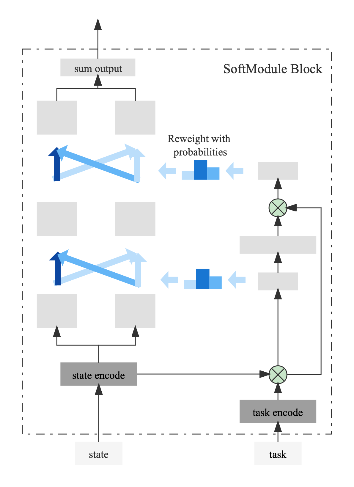
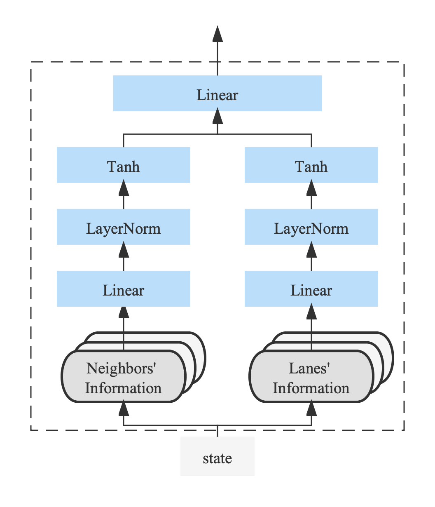
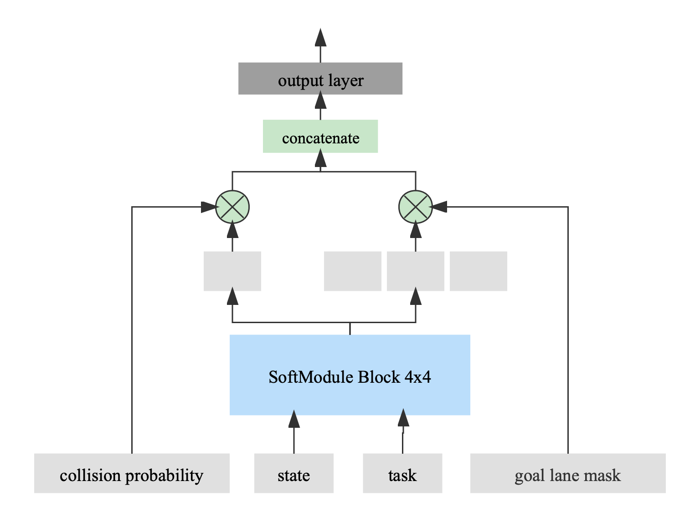
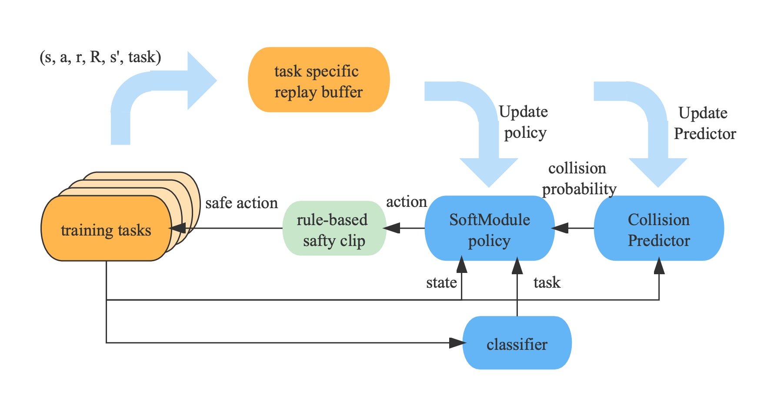

## Source code
This agent was contributed as part of NeurIPS2022 Driving SMARTS competition. The source code by original authors is available at https://github.com/GrandpaDZB/2022NeurIPS_SMARTS_competition_code.

## 1. Summary

The core idea of our approach is to train an online multi-task RL agent to solve the driving scenarios. In the following, we provide the detailed MDP formation, the RL algorithm design and the overall model architecture.

## 2. MDP formulation

### 2.1 Observation Space

The observations contain three parts of information: (1) the ego vehicle information, (2) lane information and (3)
neighboring vehicles' information. All information is transformed into the ego vehicle's view. The final concatenated
observation is a 100-dimensional vector.

In detail, the lane information contains:

- Relative positions and headings of 5 waypoints ahead.
- Speed limit.
- Lane width.
- Target lane indicator.
- Goal lane indicator.
- The indicator of whether the ego vehicle can change lanes.
- Relative lane index.

The neighboring vehicles' information contains:

- Relative positions, speeds and headings of 5 nearest neighbor vehicles.

### 2.2 Action Space

In our design, we define 11 high-level decisions with discrete action space:

- Change lanes left, speed = 0.4/0.7/1.0*speed_limit
- Change lanes right, speed = 0.4/0.7/1.0*speed_limit
- Keep lane, speed = 0.4/0.7/1.0*speed_limit
- Brake
- Reverse, speed = 0.2*speed_limit

### 2.3 Reward

- *distance travelled reward*: `The amount of distance that the ego vehicle has travelled along its mission route.`
- *events reward*: `+100 for *reached_goal*, -50 for *collisions*, -30 for *off_route/wrong_way/on_shoulder/off_road*`
- *lane changing reward*: `To discourage useless lane changing, we give a reward of -3 for each lane changing action.`
- *goal reward*: `If the distance from the end position of the ego vehicle to the goal position is smaller than 20m, we give a reward of min(5/distance to goal, 10).`

## 3. RL Algorithm

We choose Discrete Soft Actor Critic as our backbone RL algorithm. In addition, we incorporate some carefully designed components to improve the performance of our model.

### 3.1 Multi-task Model Architecture

We consider the 8 training scenarios as 8 basic skills and assume that each testing scenario can be solved by composing these learned basic skills. Overall, we train a multi-task RL agent and a scenario classifier deciding which policy to use at each decision time. The overall model architecture is shown in the Figure below.

For the multi-task RL training, we incorporate the [SoftModule](https://arxiv.org/abs/2003.13661) network as the backbone architecture of both the policy network and the Q network of the SAC algorithm. The scenario classifier is an MLP which takes the observation as input and outputs a one-hot encoding indicating which skill module to reuse.

### 3.2 State Encoder Design

Since the observation consists of the 5 neighboring vehicles' information and 3 lanes' information, we use two separate networks to process these two types of information and then merge them at the output layer. The architecture is shown below.

### 3.3 Collision Prediction and Lane Masking

In our experiment, we found that it is difficult to train the agent to actively avoid collisions and change lanes to the goal lane in an end-to-end way. So we incorporate an additional collision prediction module into the architecture. Besides, we represent the goal lane index as an additional mask, and feed it into the model. Both the two types of information are incorporated into the model by multiplying them by the output of the SoftModule in an element-wise fashion. The complete network architecture is shown in the figure below.

The collision probability is trained via a separate SARSA RL algorithm. We set the reward to be 1 when collision occurs and 0 otherwise. The Q value $Q_\pi(s,a)$ of SARSA indicates the collision probability of taking action $a$ at state $s$.

### 3.4 Rule-based Policy Enhancing

Reasonable and effective rule constraints can not only help us simplify the learning task, but also accelerate the training speed and improve the model performance. We carefully design a set of rules to help change lanes safely and brake actively to avoid collisions by judging and modifying the policy output of our RL agent.

The overall training and testing procedures are described in the figure below.

